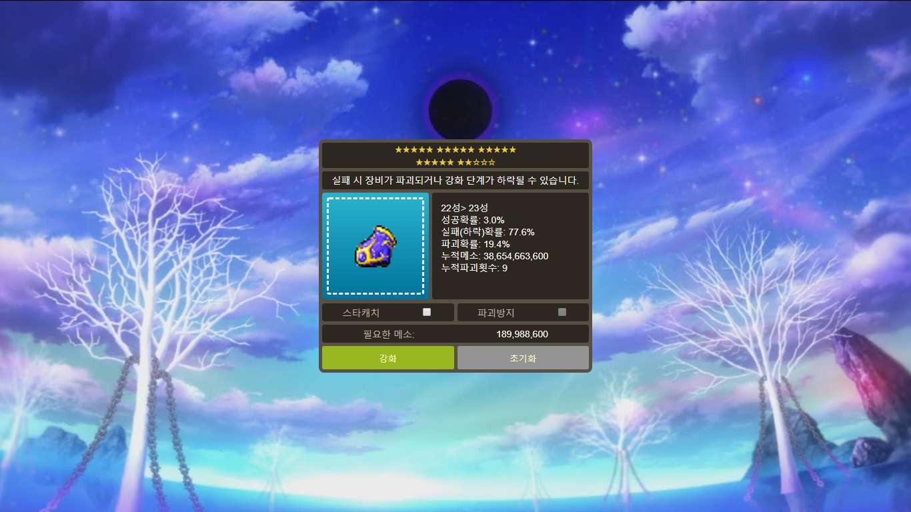

# MapleStarforce
simple maplestory starforce demo

try it out [here](https://aoc272.github.io/MapleStarforce/)

###### TODO list
- [ ] support several REQLEVs (e.g. 140, 150, 160, 200) and equipment parts (i.e. weapons, gloves, armors)
- [ ] special events (sale, success with 100%, 1 + 1, safeguard without additional cost)
- [ ] realistic enchant experience (sound, minigame)
- [ ] automated enchant
- [ ] (in further) support superior enchant and amazing equip enhancement scroll
